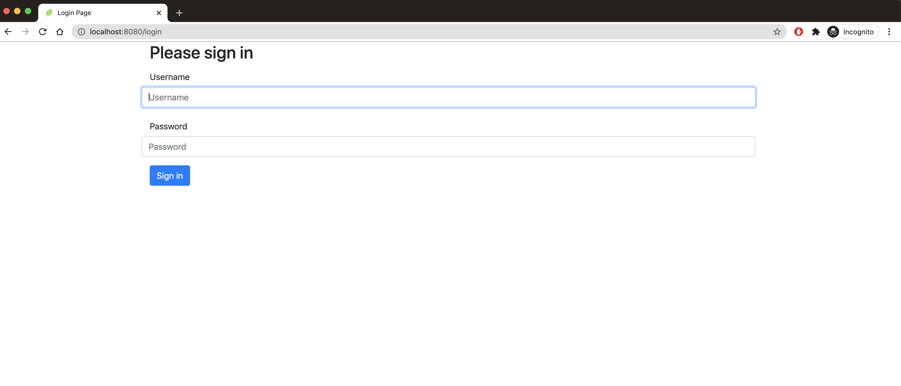
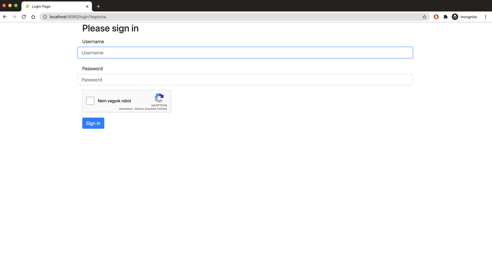
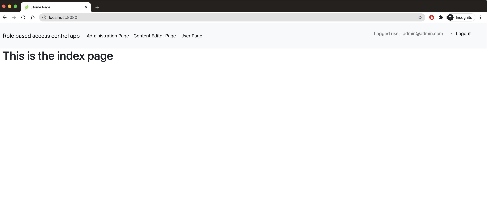
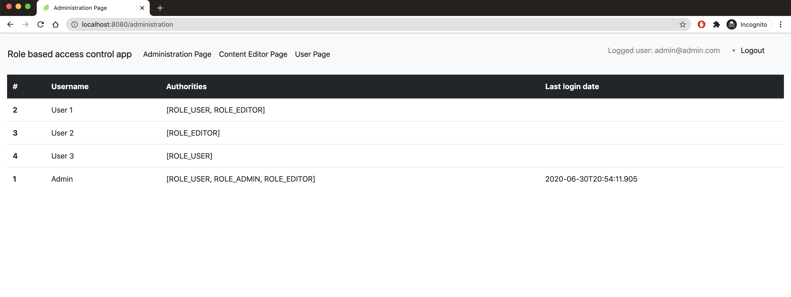
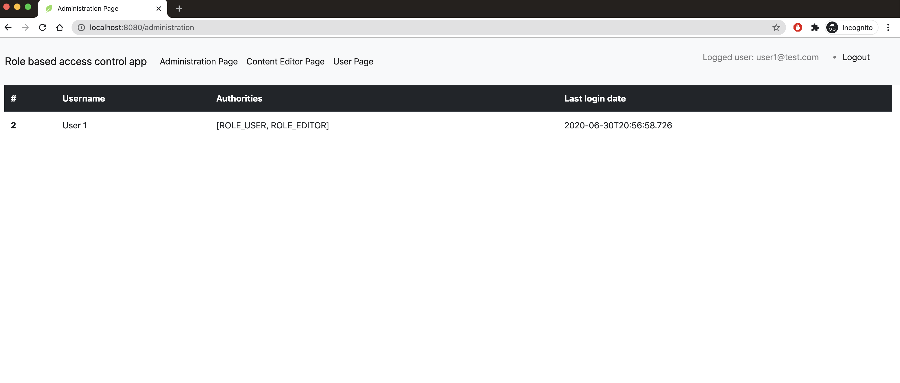
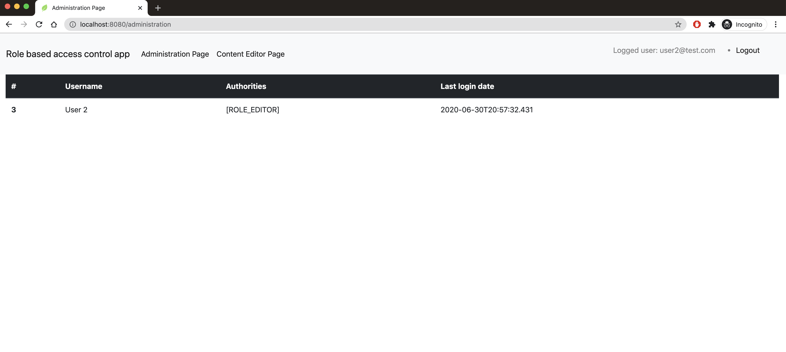
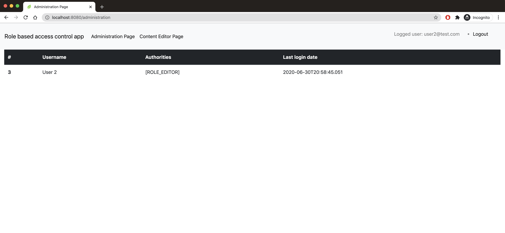
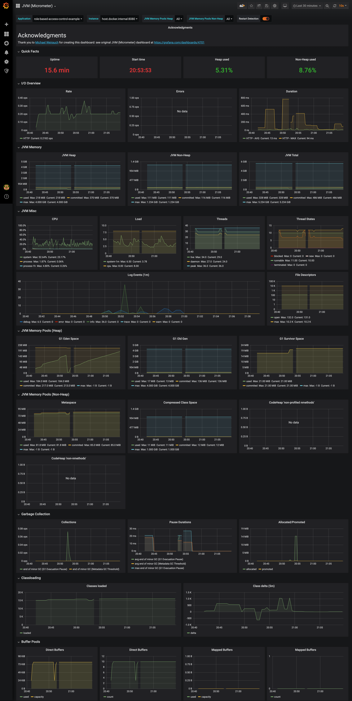
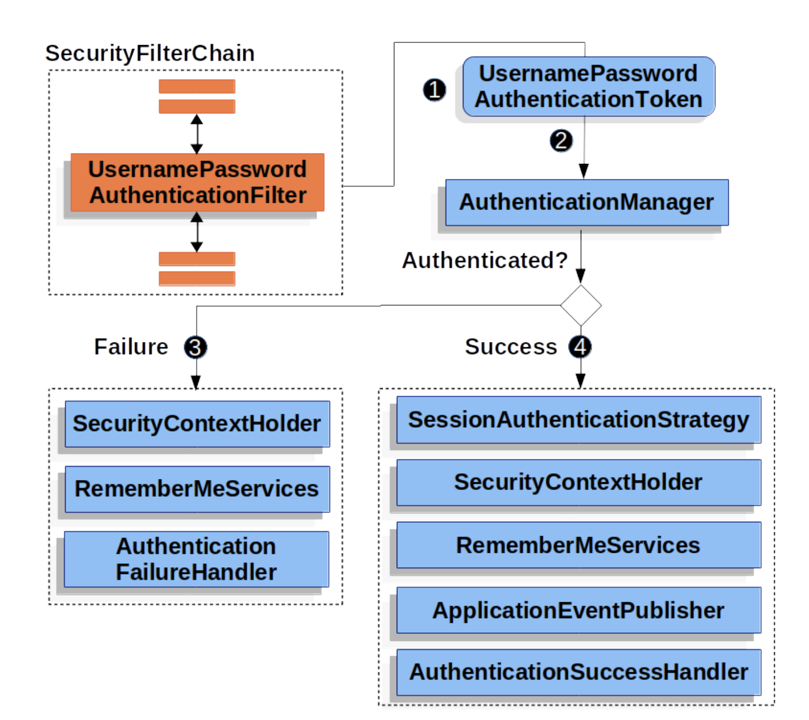

# ROLE BASED ACCESS CONTROL EXAMPLE

[](https://github.com/lombocska/role-based-access-control-example)


## DESCRIPTION

**This Spring Boot app aims to show handling login attempt and authorization of the requests.**

- The user can log in with his/her email and password to the home page.
- The data about the user has stored in a postgres database.
- In case of more than 3 failed login attempts, user needs to validate itself via a captcha.
- The logged in user can see only pages he/her is authorized.
- There is a logout functionality in the menubar.


## TECH STACK

- Spring Boot Parent 2.3.1
- Thymeleaf SpringSecurity5  5.3.0.4
- Micrometer Prometheus  1.5.1
- Lombok 1.18.12
- Postgres Driver 42.2.14
- Liquibase 3.8.9
- Google reCaptcha (v2)
- Docker
- Github Actions
- docker-compose-maven-plugin 1.0.1
- docker-file-maven-plugin 1.4.10

### Login Page



### reCaptcha after 3 failed attempts



### index page



### administration page with ADMIN, EDITOR, USER  authorities



### administration page with EDITOR & USER authorities



### administration page with only EDITOR authoritiy



### administration page with only USER authoritiy




## APPROACHES - Highlighting some tech savvy things

### layered dockerfile for efficiency

> There is a clean separation between dependencies and application resources in a Spring Boot fat jar file, 
>and we can use that fact to improve performance. 
>The key is to create layers in the container filesystem. The layers are cached both at build time 
>and at runtime (in most runtimes) so we want the most frequently changing resources, 
>usually the class and static resources in the application itself, to be layered after the more slowly changing resources. 

### prometheus for metrics

> Prometheus is an open-source systems monitoring and alerting toolkit originally built at SoundCloud. 
> Since its inception in 2012, many companies and organizations have adopted Prometheus, and the project has a very active developer and account community.

The default dashboard for JVM micrometer had created by [Michael Weirauch](https://grafana.com/orgs/mweirauch) and the template can be found [here](https://grafana.com/grafana/dashboards/4701).

 



### docker-compose-maven-plugin

> Maven plugin for running basic docker-compose commands with Maven.
In case of this app, integration tests needed postgres db running via this plugin.


### reCaptcha Google [v2]

> reCAPTCHA is a free service that protects your website from spam and abuse.
> reCAPTCHA uses an advanced risk analysis engine and adaptive challenges to keep automated software from engaging 
> in abusive activities on your site. It does this while letting your valid users pass through with ease.

I included my reCaptcha site and secret key to this project intentionally for everybody who wants to try this app out.

### user session storage via spring-session-jdbc

> Spring Session makes it trivial to support clustered sessions without being tied to an application container specific solution. 
> It also provides transparent integration with:
> HttpSession - allows replacing the HttpSession in an application container (i.e. Tomcat) 
> neutral way, with support for providing session IDs in headers to work with RESTful APIs
> etc...

### liquibase

> Liquibase is an open-source database-independent library for tracking, managing and applying database schema changes. 

As for spring-session-jdbc, schema-postgresql.sql comes from the dependency org package.


```
Note: LIQUIBASE_CONTEXTS environment variable should set to 'dev' for getting default accounts into the db.
```

### security filter chain in case of [Username/Password Authentication](https://docs.spring.io/spring-security/site/docs/current/reference/pdf/spring-security-reference.pdf)





## USAGE 

0. `./mvnw clean install` for creating the docker image of the app and running tests
1. fire up postgres, prometheus, grafana and the app itself `docker-compose -f docker/postgresql.yml docker/monitoring.yml docker/app.yml up --build`
2. visit `localhost:8080`
3. login page should prompt
4. login with valid credentials mentioned here //TODO ref
5. check pages with different authorities

6. visit `localhost:3000`
7. grafana default login credentials is `admin-admin` and skip the password change
8. visit provisioned JVM(Micrometer) dashboard and fathom micrometer metrics of the app


```
Note: docker settings (host.docker.internal) works for MacOS, but on Windows it won't. In theory, 'host' should be used on Windows, but I don't have a chance to try it out.
```

## INSPIRATIONS

- [Spring Boot Docker Layers](https://springframework.guru/why-you-should-be-using-spring-boot-docker-layers/)
- [JarLauncher](https://docs.spring.io/spring-boot/docs/current/api/org/springframework/boot/loader/JarLauncher.html)
- [Prometheus](https://prometheus.io/docs/introduction/overview/)
- [docker-compose-maven-plugin](https://github.com/dkanejs/docker-compose-maven-plugin)
- [reCaptcha](https://www.google.com/recaptcha/intro/v3.html)
- [Spring Session](https://spring.io/projects/spring-session-jdbc)


## IMPROVEMENTS POSSIBILITY

- [ ] authorization test had to be disabled, because thymeleaf template was unserializable
- [ ] tracing (sleuth)
- [ ] dockerfile run with account not default
- [ ] ELK stack for logging
- [ ] publish to docker hub via github actions
- [ ] prometheus metrics for failed, succeeded login attempts


